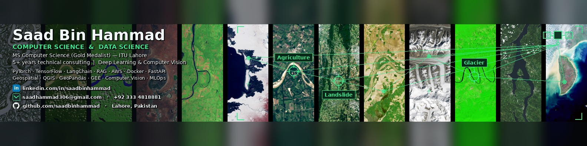

<!-- Banner -->

  

<h1 align="center">Hi, I'm Saad Bin Hammad 👋</h1>

  <b>Geospatial AI · Generative AI · MLOps</b> 
  MS Computer Science (Gold Medalist), ITU Lahore · Teaching machines to read the earth 🛰️

  
  
  

---

###  About Me

I'm an **AI engineer and researcher** working at the intersection of **geospatial deep learning, generative AI, and MLOps**. From landslide segmentation on satellite imagery to production RAG systems, I turn hard spatial and language problems into working, deployed software.

- 🎓 **MS Computer Science  [Gold Medalist]**, Information Technology University (ITU), Lahore, Punjab, Pakistan
- 🎓 **B.Sc. Electronic Engineering** , Ghulam Ishaq Khan Institute of Engineering Sciences and Technology (GIKI), Topi, Khyber Pakhtunkhwa, Pakistan
- 🛰️ Specialized in **remote sensing, computer vision, and spatial data science**
- 📄 Research published in **IEEE GRSL** 
- 💼 5+ years across research labs, startups, and consulting
- 📍 Based in **Lahore, Pakistan** 

---

###  Research

- 🛰️ **PKLandSeg** Annotation-Guided Hybrid CNN-Vision Transformer for Landslide Segmentation *(IEEE GRSL)*
  
     **Research paper link:**  https://ieeexplore.ieee.org/abstract/document/11430533

- 🛢️ **PKLandSeg** A Landslide Segmentation Dataset for Pakistan's Northern Mountains

     **Dataset link:** https://zenodo.org/records/21065148

---

###  Tech Stack

**Focus areas:** Machine Learning · Deep Learning · Spatial Datascience · Remote Sensing (SAR & Optical) · Computer Vision · Generative AI & RAG · MLOps

---

###  Get in Touch

- 📧 **Email:** saadhammad306@gmail.com
- 📱 **Phone:** +92 333 4818881
- 💼 **LinkedIn:** [saad-bin-hammad](https://www.linkedin.com/in/saad-bin-hammad-89b584108/)
- 🌐 **Portfolio:** [saadhammad14.github.io/portfolio](https://saadhammad14.github.io/portfolio/)
- 🏢 **Company:** [Tech Supa](https://techsupa.com/) · [Tech Supa × RSA Lab](https://rsa.techsupa.com/)

---

  

